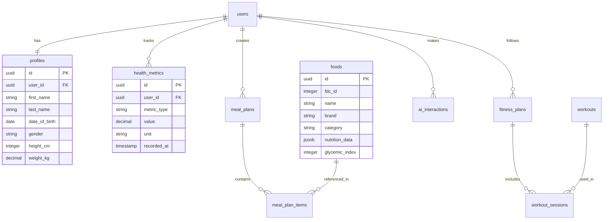

# HealthCoachAI Architecture Documentation

## 🏗️ Architecture Overview

HealthCoachAI is a production-ready, scalable health coaching platform built with a modern,
cloud-native architecture. This document provides a comprehensive overview of the system
architecture, design patterns, and technical decisions.

## 📋 Table of Contents

- [System Architecture](#system-architecture)
- [Technology Stack](#technology-stack)
- [Application Components](#application-components)
- [Data Architecture](#data-architecture)
- [Security Architecture](#security-architecture)
- [Integration Architecture](#integration-architecture)
- [Deployment Architecture](#deployment-architecture)
- [Performance Considerations](#performance-considerations)
- [Monitoring & Observability](#monitoring--observability)

## 🌐 System Architecture

### High-Level Architecture


### Architectural Principles

1. **Domain-Driven Design (DDD)**: Clear domain boundaries and ubiquitous language
2. **Microservices**: Loosely coupled, independently deployable services
3. **Event-Driven**: Asynchronous communication through events
4. **CQRS**: Command Query Responsibility Segregation for read/write optimization
5. **Cloud-Native**: Designed for cloud environments with auto-scaling
6. **Security-First**: Security and privacy by design
7. **Mobile-First**: Optimized for mobile user experience

## 🔧 Technology Stack

### Mobile Applications

#### iOS

- **Framework**: SwiftUI for declarative UI
- **Architecture**: MVVM + Combine for reactive programming
- **Networking**: URLSession with async/await
- **Storage**: Core Data + CloudKit sync
- **Authentication**: AuthenticationServices framework
- **Analytics**: StoreKit 2 for in-app purchases
- **Health**: HealthKit integration

#### Android

- **Framework**: Jetpack Compose for modern UI
- **Architecture**: MVVM + Flow for reactive streams
- **Networking**: Retrofit + OkHttp
- **Storage**: Room database + DataStore
- **Authentication**: Credential Manager API
- **Health**: Health Connect integration

### Backend Services

#### Core Technologies

- **Runtime**: Node.js 18 LTS
- **Framework**: NestJS with TypeScript
- **API**: REST + GraphQL hybrid
- **Validation**: class-validator + class-transformer
- **Documentation**: OpenAPI/Swagger
- **Testing**: Jest + Supertest

#### Databases

- **Primary**: PostgreSQL 15 with extensions
- **Cache**: Redis 7 with clustering
- **Search**: Elasticsearch (optional)
- **Vector**: pgvector for embeddings
- **Time Series**: TimescaleDB extension

#### Infrastructure

- **Containerization**: Docker + Docker Compose
- **Orchestration**: Kubernetes (production)
- **Service Mesh**: Istio (production)
- **Message Queue**: Redis Streams
- **File Storage**: AWS S3 / Google Cloud Storage

### AI & ML Stack

#### AI Providers

- **Primary**: OpenAI GPT-4/GPT-4 Turbo
- **Secondary**: Anthropic Claude 3
- **Specialized**: Google Vertex AI for specific tasks
- **Open Source**: Llama 2 for cost optimization

#### ML Tools

- **Embeddings**: OpenAI text-embedding-ada-002
- **Vector Database**: pgvector with PostgreSQL
- **Model Serving**: Custom routing with fallbacks
- **Monitoring**: Custom metrics + alerts

## 🧩 Application Components

### Authentication Service

```typescript
// Core authentication functionality
interface AuthService {
  // Phone-based authentication
  sendOTP(phone: string): Promise<void>;
  verifyOTP(phone: string, code: string): Promise<AuthResult>;

  // OAuth providers
  authenticateOAuth(provider: OAuthProvider, token: string): Promise<AuthResult>;

  // Token management
  refreshToken(refreshToken: string): Promise<TokenPair>;
  revokeToken(userId: string, deviceId: string): Promise<void>;

  // Device management
  registerDevice(userId: string, deviceInfo: DeviceInfo): Promise<void>;
  listDevices(userId: string): Promise<Device[]>;
}
```

#### Features

- Multi-factor authentication (SMS, TOTP, biometric)
- OAuth integration (Apple, Google, Facebook)
- JWT tokens with automatic refresh
- Device binding and management
- Session management with Redis

### Profile Service

```typescript
// User profile and preferences management
interface ProfileService {
  // Profile management
  createProfile(userId: string, profile: CreateProfileDto): Promise<Profile>;
  updateProfile(userId: string, updates: UpdateProfileDto): Promise<Profile>;
  getProfile(userId: string): Promise<Profile>;

  // Health data
  updateHealthMetrics(userId: string, metrics: HealthMetrics): Promise<void>;
  getHealthHistory(userId: string, timeRange: TimeRange): Promise<HealthMetrics[]>;

  // Preferences
  updatePreferences(userId: string, prefs: UserPreferences): Promise<void>;
  updateGoals(userId: string, goals: HealthGoals): Promise<void>;
}
```

#### Features

- Comprehensive user profiles
- Health metrics tracking
- Dietary preferences and restrictions
- Fitness goals and preferences
- Privacy settings and consent

### Nutrition Service

```typescript
// Nutrition analysis and meal planning
interface NutritionService {
  // Food database
  searchFoods(query: string, filters: FoodFilters): Promise<Food[]>;
  getFoodDetails(foodId: string): Promise<FoodDetails>;

  // Nutrition analysis
  analyzeRecipe(recipe: Recipe): Promise<NutritionAnalysis>;
  calculateGlycemicLoad(meal: Meal): Promise<GlycemicAnalysis>;

  // Meal planning
  generateMealPlan(userId: string, preferences: MealPlanPrefs): Promise<MealPlan>;
  adaptMealPlan(userId: string, feedback: Feedback): Promise<MealPlan>;
}
```

#### Features

- USDA FDC and IFCT database integration
- Real-time nutrition analysis
- Glycemic index/load calculations
- Personalized meal planning
- Recipe recommendation engine

### Fitness Service

```typescript
// Fitness planning and workout management
interface FitnessService {
  // Workout library
  getWorkouts(filters: WorkoutFilters): Promise<Workout[]>;
  getWorkoutDetails(workoutId: string): Promise<WorkoutDetails>;

  // Fitness planning
  generateFitnessPlan(userId: string, goals: FitnessGoals): Promise<FitnessPlan>;
  adaptFitnessPlan(userId: string, performance: Performance): Promise<FitnessPlan>;

  // Progress tracking
  logWorkout(userId: string, workout: WorkoutLog): Promise<void>;
  getProgressAnalytics(userId: string, timeRange: TimeRange): Promise<ProgressData>;
}
```

#### Features

- Comprehensive workout library
- Personalized fitness planning
- Progress tracking and analytics
- Integration with wearable devices
- Adaptive workout recommendations

### AI Router Service

```typescript
// AI request routing and orchestration
interface AIRouterService {
  // Request routing
  routeRequest(request: AIRequest): Promise<AIResponse>;

  // Provider management
  getAvailableProviders(): Promise<AIProvider[]>;
  getProviderStatus(providerId: string): Promise<ProviderStatus>;

  // Quota management
  checkQuota(userId: string, requestType: RequestType): Promise<QuotaStatus>;
  updateQuota(userId: string, usage: Usage): Promise<void>;

  // Quality assurance
  validateResponse(response: AIResponse): Promise<ValidationResult>;
  logInteraction(interaction: AIInteraction): Promise<void>;
}
```

#### Features

- Multi-provider AI routing
- Cost optimization algorithms
- Quality assurance checks
- Usage quota management
- Response caching

## 💾 Data Architecture

### Database Design

#### Core Entities

```sql
-- Users and Authentication
CREATE TABLE users (
    id UUID PRIMARY KEY DEFAULT gen_random_uuid(),
    phone VARCHAR(20) UNIQUE,
    email VARCHAR(255) UNIQUE,
    created_at TIMESTAMPTZ DEFAULT NOW(),
    updated_at TIMESTAMPTZ DEFAULT NOW()
);

-- User Profiles
CREATE TABLE profiles (
    id UUID PRIMARY KEY DEFAULT gen_random_uuid(),
    user_id UUID REFERENCES users(id) ON DELETE CASCADE,
    first_name VARCHAR(100),
    last_name VARCHAR(100),
    date_of_birth DATE,
    gender VARCHAR(20),
    height_cm INTEGER,
    weight_kg DECIMAL(5,2),
    activity_level VARCHAR(20),
    created_at TIMESTAMPTZ DEFAULT NOW(),
    updated_at TIMESTAMPTZ DEFAULT NOW()
);

-- Health Metrics
CREATE TABLE health_metrics (
    id UUID PRIMARY KEY DEFAULT gen_random_uuid(),
    user_id UUID REFERENCES users(id) ON DELETE CASCADE,
    metric_type VARCHAR(50),
    value DECIMAL(10,3),
    unit VARCHAR(20),
    recorded_at TIMESTAMPTZ,
    source VARCHAR(50),
    created_at TIMESTAMPTZ DEFAULT NOW()
);

-- Food Database
CREATE TABLE foods (
    id UUID PRIMARY KEY DEFAULT gen_random_uuid(),
    fdc_id INTEGER UNIQUE,
    name VARCHAR(255) NOT NULL,
    brand VARCHAR(255),
    category VARCHAR(100),
    nutrition_data JSONB,
    glycemic_index INTEGER,
    glycemic_load DECIMAL(5,2),
    created_at TIMESTAMPTZ DEFAULT NOW()
);

-- Meal Plans
CREATE TABLE meal_plans (
    id UUID PRIMARY KEY DEFAULT gen_random_uuid(),
    user_id UUID REFERENCES users(id) ON DELETE CASCADE,
    name VARCHAR(255),
    start_date DATE,
    end_date DATE,
    calories_target INTEGER,
    plan_data JSONB,
    created_at TIMESTAMPTZ DEFAULT NOW()
);

-- Fitness Plans
CREATE TABLE fitness_plans (
    id UUID PRIMARY KEY DEFAULT gen_random_uuid(),
    user_id UUID REFERENCES users(id) ON DELETE CASCADE,
    name VARCHAR(255),
    goals JSONB,
    workouts JSONB,
    schedule JSONB,
    created_at TIMESTAMPTZ DEFAULT NOW()
);

-- AI Interactions
CREATE TABLE ai_interactions (
    id UUID PRIMARY KEY DEFAULT gen_random_uuid(),
    user_id UUID REFERENCES users(id) ON DELETE CASCADE,
    session_id UUID,
    provider VARCHAR(50),
    model VARCHAR(100),
    request_type VARCHAR(50),
    tokens_used INTEGER,
    cost_cents INTEGER,
    response_quality DECIMAL(3,2),
    created_at TIMESTAMPTZ DEFAULT NOW()
);
```

#### Data Relationships



### Caching Strategy

#### Redis Cache Layers

```typescript
// Cache configuration
const cacheConfig = {
  // Session cache (short-lived)
  sessions: {
    ttl: 60 * 60, // 1 hour
    keyPattern: 'session:{sessionId}',
  },

  // User profile cache (medium-lived)
  profiles: {
    ttl: 60 * 60 * 24, // 24 hours
    keyPattern: 'profile:{userId}',
  },

  // Food database cache (long-lived)
  foods: {
    ttl: 60 * 60 * 24 * 7, // 7 days
    keyPattern: 'food:{foodId}',
  },

  // AI responses cache (configurable)
  aiResponses: {
    ttl: 60 * 60 * 12, // 12 hours
    keyPattern: 'ai:{requestHash}',
  },
};
```

## 🔒 Security Architecture

### Security Layers

1. **Network Security**
   - WAF with DDoS protection
   - VPC with private subnets
   - Security groups and NACLs
   - TLS 1.3 for all communications

2. **Application Security**
   - JWT authentication with short expiry
   - RBAC with fine-grained permissions
   - Input validation and sanitization
   - SQL injection prevention

3. **Data Security**
   - AES-256 encryption at rest
   - Field-level encryption for PII/PHI
   - Database connection encryption
   - Backup encryption

4. **API Security**
   - Rate limiting per user/IP
   - API key management
   - Request signing for sensitive operations
   - CORS configuration

### Authentication Flow


## 🔗 Integration Architecture

### External Integrations

#### Health Data Integration

```typescript
// HealthKit (iOS) integration
interface HealthKitIntegration {
  requestPermissions(types: HealthDataType[]): Promise<boolean>;
  readHealthData(type: HealthDataType, startDate: Date, endDate: Date): Promise<HealthData[]>;
  writeHealthData(data: HealthData): Promise<boolean>;
  observeHealthData(type: HealthDataType, callback: HealthDataCallback): void;
}

// Google Fit (Android) integration
interface GoogleFitIntegration {
  connect(): Promise<boolean>;
  requestPermissions(scopes: FitnessScope[]): Promise<boolean>;
  readFitnessData(request: FitnessDataRequest): Promise<FitnessData[]>;
  insertFitnessData(data: FitnessData): Promise<boolean>;
}
```

#### AI Provider Integration

```typescript
// Multi-provider AI client
class AIProviderClient {
  private providers = new Map<string, AIProvider>();

  async routeRequest(request: AIRequest): Promise<AIResponse> {
    const provider = await this.selectProvider(request);
    return await provider.makeRequest(request);
  }

  private async selectProvider(request: AIRequest): Promise<AIProvider> {
    const level = this.determineLevel(request);
    const providers = this.getAvailableProviders(level);

    if (level === 'L1') {
      return this.selectHighestAccuracy(providers);
    } else {
      return this.selectCostOptimal(providers);
    }
  }
}
```

## 🚀 Deployment Architecture

### Container Architecture

```dockerfile
# Multi-stage build for backend services
FROM node:18-alpine AS base
WORKDIR /app
COPY package*.json pnpm-lock.yaml ./
RUN corepack enable pnpm && pnpm install --frozen-lockfile

FROM base AS builder
COPY . .
RUN pnpm build

FROM node:18-alpine AS runtime
WORKDIR /app
COPY --from=builder /app/dist ./dist
COPY --from=builder /app/node_modules ./node_modules
EXPOSE 3000
CMD ["node", "dist/main.js"]
```

### Kubernetes Deployment

```yaml
# Example deployment configuration
apiVersion: apps/v1
kind: Deployment
metadata:
  name: auth-service
spec:
  replicas: 3
  selector:
    matchLabels:
      app: auth-service
  template:
    metadata:
      labels:
        app: auth-service
    spec:
      containers:
        - name: auth-service
          image: healthcoach/auth-service:latest
          ports:
            - containerPort: 3000
          env:
            - name: DATABASE_URL
              valueFrom:
                secretKeyRef:
                  name: db-secret
                  key: url
          resources:
            requests:
              memory: '256Mi'
              cpu: '250m'
            limits:
              memory: '512Mi'
              cpu: '500m'
          livenessProbe:
            httpGet:
              path: /health
              port: 3000
            initialDelaySeconds: 30
            periodSeconds: 10
          readinessProbe:
            httpGet:
              path: /ready
              port: 3000
            initialDelaySeconds: 5
            periodSeconds: 5
```

### Auto-Scaling Configuration

```yaml
# Horizontal Pod Autoscaler
apiVersion: autoscaling/v2
kind: HorizontalPodAutoscaler
metadata:
  name: auth-service-hpa
spec:
  scaleTargetRef:
    apiVersion: apps/v1
    kind: Deployment
    name: auth-service
  minReplicas: 2
  maxReplicas: 10
  metrics:
    - type: Resource
      resource:
        name: cpu
        target:
          type: Utilization
          averageUtilization: 70
    - type: Resource
      resource:
        name: memory
        target:
          type: Utilization
          averageUtilization: 80
```

## ⚡ Performance Considerations

### Performance Targets

| Metric              | Target        | Measurement          |
| ------------------- | ------------- | -------------------- |
| API Response Time   | < 200ms (p95) | All API endpoints    |
| Database Query Time | < 100ms (p95) | Complex queries      |
| App Launch Time     | < 3s          | Cold start to usable |
| Screen Navigation   | < 100ms       | Between screens      |
| AI Response Time    | < 5s (p95)    | Standard requests    |
| Search Response     | < 300ms       | Food/exercise search |

### Optimization Strategies

#### Backend Optimizations

- Connection pooling for databases
- Redis caching for frequent queries
- Query optimization with proper indexing
- Background job processing with queues
- CDN for static assets

#### Mobile Optimizations

- Image optimization and lazy loading
- Code splitting and tree shaking
- Offline-first architecture
- Background sync for data
- Memory management best practices

#### Database Optimizations

```sql
-- Performance indexes
CREATE INDEX CONCURRENTLY idx_health_metrics_user_date
ON health_metrics(user_id, recorded_at DESC);

CREATE INDEX CONCURRENTLY idx_foods_search
ON foods USING gin(to_tsvector('english', name || ' ' || brand));

CREATE INDEX CONCURRENTLY idx_ai_interactions_user_session
ON ai_interactions(user_id, session_id, created_at DESC);

-- Partitioning for large tables
CREATE TABLE health_metrics_y2024m01 PARTITION OF health_metrics
FOR VALUES FROM ('2024-01-01') TO ('2024-02-01');
```

## 📊 Monitoring & Observability

### Observability Stack

#### Metrics (Prometheus + Grafana)

```typescript
// Custom metrics
const metrics = {
  apiRequests: new Counter({
    name: 'api_requests_total',
    help: 'Total API requests',
    labelNames: ['method', 'endpoint', 'status'],
  }),

  aiRequests: new Counter({
    name: 'ai_requests_total',
    help: 'Total AI requests',
    labelNames: ['provider', 'model', 'level'],
  }),

  responseTime: new Histogram({
    name: 'api_response_time_seconds',
    help: 'API response time',
    labelNames: ['endpoint'],
    buckets: [0.1, 0.5, 1, 2, 5],
  }),
};
```

#### Logging (Structured JSON)

```typescript
// Structured logging
const logger = createLogger({
  level: 'info',
  format: format.combine(format.timestamp(), format.errors({ stack: true }), format.json()),
  defaultMeta: {
    service: 'auth-service',
    version: process.env.APP_VERSION,
  },
});

// Usage example
logger.info('User authenticated', {
  userId: user.id,
  method: 'phone_otp',
  deviceId: device.id,
  ipAddress: req.ip,
});
```

#### Tracing (OpenTelemetry)

```typescript
// Distributed tracing setup
const tracer = trace.getTracer('healthcoach-auth', '1.0.0');

async function authenticateUser(phone: string, otp: string) {
  const span = tracer.startSpan('authenticate_user');
  span.setAttributes({
    'user.phone': phone,
    'auth.method': 'otp',
  });

  try {
    // Authentication logic
    const result = await verifyOTP(phone, otp);
    span.setStatus({ code: SpanStatusCode.OK });
    return result;
  } catch (error) {
    span.recordException(error);
    span.setStatus({ code: SpanStatusCode.ERROR });
    throw error;
  } finally {
    span.end();
  }
}
```

### Health Checks

```typescript
// Health check endpoints
@Get('/health')
async getHealth(): Promise<HealthStatus> {
  return {
    status: 'healthy',
    timestamp: new Date().toISOString(),
    uptime: process.uptime(),
    version: process.env.APP_VERSION
  };
}

@Get('/ready')
async getReadiness(): Promise<ReadinessStatus> {
  const checks = await Promise.allSettled([
    this.databaseService.ping(),
    this.redisService.ping(),
    this.externalApiService.ping()
  ]);

  const healthy = checks.every(check => check.status === 'fulfilled');

  return {
    status: healthy ? 'ready' : 'not ready',
    checks: checks.map((check, index) => ({
      name: ['database', 'redis', 'external-api'][index],
      status: check.status === 'fulfilled' ? 'up' : 'down'
    }))
  };
}
```

---

## 📚 Additional Resources

- [API Documentation](./docs/api/README.md)
- [Development Guide](./docs/development/README.md)
- [Deployment Guide](./docs/deployment/README.md)
- [Security Guide](./SECURITY_PRIVACY.md)
- [Contributing Guide](./CONTRIBUTING.md)

---

## 📅 Document Information

- **Version**: 1.0.0
- **Last Updated**: 2024-01-XX
- **Next Review**: 2024-04-XX
- **Maintained By**: Architecture Team
- **Approved By**: CTO, Lead Architect

This architecture documentation is a living document that evolves with the system. Regular reviews
ensure it remains accurate and useful for development teams.
